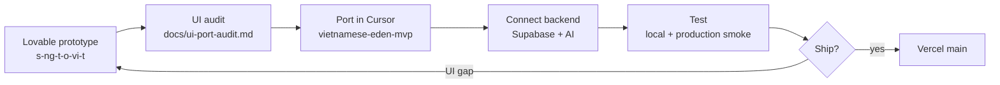

# Frontend workflow — Lovable prototype → Cursor production

**Mục đích:** Ghi rõ ai làm gì giữa **Lovable** (UI prototype) và **Cursor** (production app).

| Repo | Vai trò | Stack |
|------|---------|--------|
| `C:\Users\ADMIN\s-ng-t-o-vi-t` | **UI prototype** (Lovable + TanStack Start) | Vite 7, TanStack Router, Tailwind v4, mock data |
| `C:\Users\ADMIN\vietnamese-eden-mvp` | **Production** | Next.js 14 App Router, Tailwind v3, Supabase, AI (Xiaomi MiMo), Vercel |

**Quy tắc:** Production **không** copy nguyên TanStack/Lovable runtime. Chỉ port **UI patterns**, tokens, và layout — logic/data/auth/AI viết trong production repo.

---

## Khi nào dùng Lovable

| Tình huống | Lovable |
|------------|---------|
| Thử layout mới, marketing section, board grid, modal flow | ✅ |
| Iterate nhanh bằng prompt + visual editor | ✅ |
| Mock data, không cần Supabase/RLS | ✅ |
| So sánh 2–3 biến thể UI trước khi commit port | ✅ |

**Không dùng Lovable cho:** auth thật, RLS, server actions, AI provider, deploy production, env secrets.

---

## Khi nào dùng Cursor (production repo)

| Tình huống | Cursor |
|------------|--------|
| Port UI từ prototype sang Next.js | ✅ |
| Nối Supabase (queries, RLS, migrations) | ✅ |
| AI Breakdown / Remix / Voice (server) | ✅ |
| Auth, middleware, Vercel deploy, smoke test | ✅ |
| Beta docs, bugfix, JSON parser, production env | ✅ |

**Không làm trong prototype repo:** mọi thứ ship lên https://vietnamese-eden-mvp.vercel.app/

---

## Quy trình đề xuất

### Bước chi tiết

1. **Lovable** — Thiết kế/refine page hoặc component trong `s-ng-t-o-vi-t`; giữ mock data; chụp screenshot hoặc ghi route file (`src/routes/*.tsx`).
2. **Audit** — Cập nhật [ui-port-audit.md](./ui-port-audit.md): PORT / DEFER / DROP, route mapping, component list.
3. **Port (Cursor)** — Trong `vietnamese-eden-mvp`:
   - Tạo/sửa `src/app/(app)/.../page.tsx` + `src/components/custom/...`
   - `Link` / `usePathname` thay TanStack Router
   - `next/font` thay Google link trực tiếp
   - Tailwind v3 tokens trong `globals.css` / `tailwind.config.ts`
4. **Connect backend** — Server actions, Supabase client, AI `src/lib/ai/*`; **không** port `mock-data.ts` nguyên khối.
5. **Test** — `npm run lint`, `type-check`, `build`; production smoke [production-smoke-test.md](./production-smoke-test.md).
6. **Ship** — Merge `main` → Vercel; cập nhật [project-status.md](./project-status.md).

---

## Mapping nhanh (TanStack → Next.js)

| Prototype | Production |
|-----------|--------------|
| `src/routes/dashboard.tsx` | `src/app/(app)/dashboard/page.tsx` |
| `src/routes/boards.tsx` | `src/app/(app)/boards/page.tsx` |
| `src/routes/boards.$boardId.tsx` | `src/app/(app)/boards/[boardId]/page.tsx` |
| `src/routes/breakdown.$postId.tsx` | `src/app/(app)/breakdown/[contentItemId]/page.tsx` |
| `src/routes/voice.tsx` | `src/app/(app)/voice/page.tsx` |
| `src/routes/remix.tsx` + detail | `src/app/(app)/remix/` + `[contentItemId]` |
| `src/routes/calendar.tsx` | `src/app/(app)/calendar/page.tsx` |
| `src/routes/index.tsx` | `src/app/page.tsx` + `components/custom/landing/*` (adapted) |
| `src/routes/pricing.tsx` | `src/app/(app)/pricing/page.tsx` (partial; pricing chính trên landing) |

Auth routes (`/login`, `/signup`) — **chỉ production**, không có trong prototype.

---

## File KHÔNG port từ Lovable

| Item | Lý do |
|------|--------|
| `__root.tsx`, `routeTree.gen.ts` | TanStack-specific |
| `lib/lovable-error-reporting.ts` | Lovable platform |
| Toàn bộ `components/ui/` prototype | Dùng shadcn CLI trên production (`radix-nova`) |
| `mock-data.ts` (runtime) | Thay Supabase queries |

---

## Tài liệu liên quan

| Doc | Nội dung |
|-----|----------|
| [ui-port-audit.md](./ui-port-audit.md) | Inventory + trạng thái port từng page |
| [ui-port-plan.md](./ui-port-plan.md) | Kế hoạch milestone M1–M7 (lịch sử) |
| [project-status.md](./project-status.md) | Stack + beta readiness |
